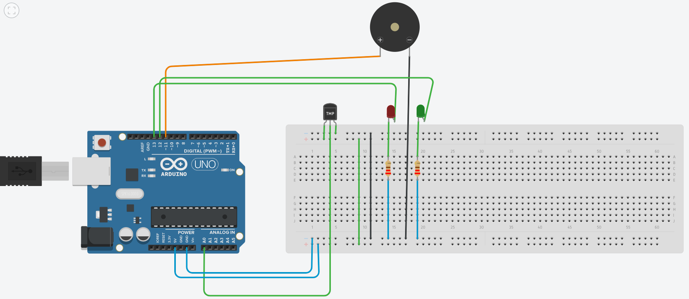

# Fire Detection and Alert System

An Arduino-based temperature tracking and safety alarm system simulated in Tinkercad. The system continuously samples ambient environment data to flag hazardous heat events.

## Features
- **Real-time Monitoring:** Tracks temperature metrics via the Serial Monitor.
- **Visual Feedback:** Toggles status states using color signaling (Green = Safe, Red = Danger).
- **Audible Hazard Alarms:** Drives a piezo warning buzzer during emergency states.

## Component List
- Arduino Uno R3
- TMP36 Analog Temperature Sensor
- Piezo Buzzer
- Red & Green LEDs
- 220Ω Resistors

## Circuit Configuration

